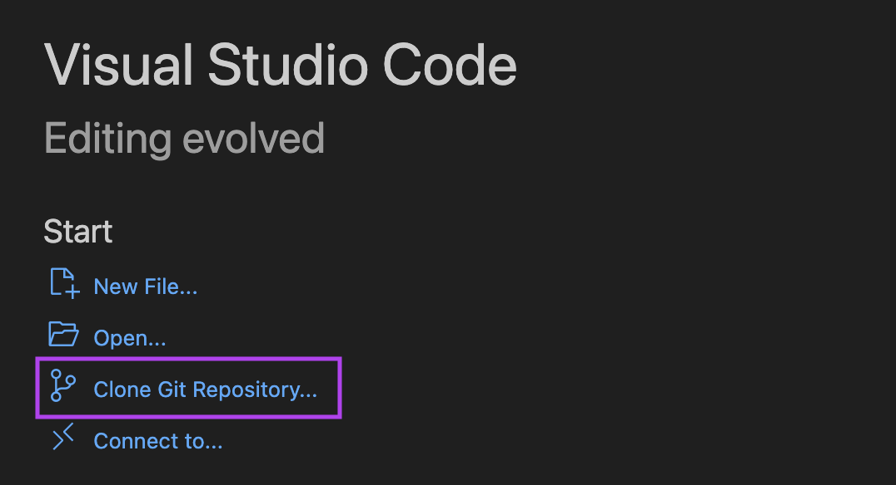
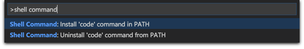
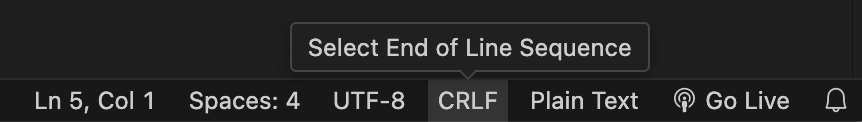
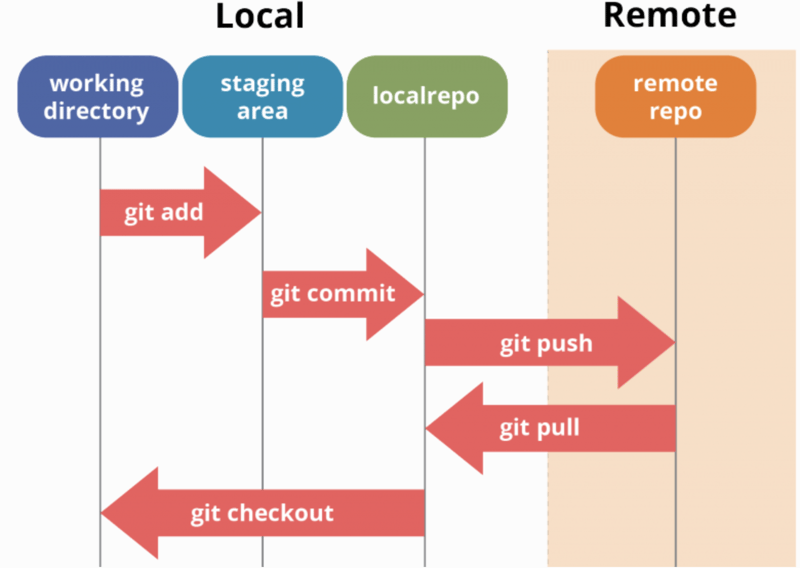

# Introduction to node.js and progressive web apps

This guided tutorial will introduce HSC Software Engineering to the basics of developing websites with the [node.JS framework](https://nodejs.org/en). The tutorial has been specifically designed for requirements in the [NESA Software Engineering Syllabus](https://curriculum.nsw.edu.au/learning-areas/tas/software-engineering-11-12-2022/content/n12/fa6aab137e) and students in NSW Department of Education schools using eT4L computers. This screen capture shows how the final PWA will be rendered to the user.


## Overview of Progressive Web Apps

A [Progressive Web App (PWA)](https://developer.mozilla.org/en-US/docs/Web/Progressive_web_apps?ref=arctype.com) is an app that is built using web platform technologies, but that provides a user experience like that of a platform-specific app. Like a website, a PWA can run on multiple platforms and devices from a single codebase. Like a platform-specific app, it can be installed on the device, can operate while offline and in the background, and can integrate with the device and with other installed apps. There are [many popular PWAs](https://business.adobe.com/blog/basics/progressive-web-app-examples), including Uber, Spotify, Facebook and Google Maps.

<details>
  <summary>Technical features of PWAs</summary>
Because PWAs are websites, they have the same basic features as any other website: at least one HTML page, which loads CSS and JavaScript. Javascript is the language of the web and is exclusively used for the client-side front end; python, in the web context, can only be used in the back end. Like a normal website, the JavaScript loaded by the page has a global Window object and can access all the Web APIs that are available through that object. The PWA standard as defined by [W3C Standards](https://www.w3.org/standards/) has some specific features additional to a website:

| Feature             | Purpose                                                                                                                                                                                                                                                                                                                                  |
| ------------------- | ---------------------------------------------------------------------------------------------------------------------------------------------------------------------------------------------------------------------------------------------------------------------------------------------------------------------------------------- |
| manifest.json       | An app manifest file, which, at a minimum, provides information that the operating system needs to install the PWA, such as the app name, screen orientation and icon set for different-sized viewports.                                                                                                                                 |
| serviceworker.js    | A service worker, which, at a minimum, manages the caching that enables an online and offline experience whilst also interfacing with API's such as the [notification web API](https://developer.mozilla.org/en-US/docs/Web/API/Notification). It's important to udnerstand that this JS file cannot control the DOM of the application. |
| Icons & screenshots | A set of icons and screenshots that are used when uploading to an app store and when installing it as a native application. It is these icons that will be used in the desktop or app launcher when installed.                                                                                                                           |
| Installable         | Because of the information contained in the manifest.json all PWA's can be installed like a native app. They can also be packaged and uploaded to the Google, Microsoft & Apple app stores.                                                                                                                                              |
| Cached locally      | Because the service worker details all apps and pages to be cached (all pages must have a \*.html name), the app and its resources can be cached locally for quick load times. _Note backend apps where the web server serves all pages from the DNS root do not meet the PWA specification._                                            |

The below image illustrates how the servicework manages online and offline behaviour.


</details>

---

## Steps to initialising your first PWA

### 1. Setup your development environment

1. Download [VSCode](https://code.visualstudio.com/) to use as your IDE (integrated development environment).

2. Install the necessary VSCode extensions for this tutorial.

| Required Extensions                                                                                              | Suggested nodeJS Extensions                                                                          |
| ---------------------------------------------------------------------------------------------------------------- | ---------------------------------------------------------------------------------------------------- |
| [McCarter.start-git-bash](https://marketplace.visualstudio.com/items?itemName=McCarter.start-git-bash)           | [ecmel.vscode-html-css](https://marketplace.visualstudio.com/items?itemName=ecmel.vscode-html-css)   |
| [yy0931.vscode-sqlite3-editor](https://marketplace.visualstudio.com/items?itemName=yy0931.vscode-sqlite3-editor) | [ms-vscode.js-debug](https://marketplace.visualstudio.com/items?itemName=ms-vscode.js-debug)         |
| [medo64.render-crlf](https://marketplace.visualstudio.com/items?itemName=medo64.render-crlf)                     | [esbenp.prettier-vscode](https://marketplace.visualstudio.com/items?itemName=esbenp.prettier-vscode) |
|                                                                                                                  | [oderwat.indent-rainbow](https://marketplace.visualstudio.com/items?itemName=oderwat.indent-rainbow) |

3.  Download and install [Node.js](https://nodejs.org/en/download/prebuilt-installer) v20.18.0.

4.   Windows users: Download [git](https://git-scm.com/).

5.  [Create](https://github.com/signup) or [login](https://github.com/login) to your GitHub account.

6.  Accept the GitHub Classroom assignment to create your own version of this repository.

7.  Open VSCode. On the welcome screen, click `Clone Git Repository`.
    

8.  Select `Clone from GitHub`, login then select your `intro-to-PWA` repository.

9.  Open VSCode, then open a terminal using <kbd>Ctrl</kbd> + <kbd>`</kbd>.

    > [!NOTE]
    > From now on, you should aim to run all commands from the CLI. You are discouraged from left/right clicking the GUI. You will find it feels slow at first, but through disciplined use, you will become much quicker and more accurate with CLI commands than GUI controls.

10. At the top right of the terminal, click the dropdown next to `+` and select `bash` or `Git Bash`.
    

    > [!TIP] > **What is this doing?** Different operating systems have different default scripting languages within their terminals (aka command lines). For this project, we’ll all be using `bash`.

11. In terminal, type:

    ```bash
    git status
    ```

    You should see:

    ```
    On branch main
    Your branch is up to date with 'origin/main'.
    ```

    > [!WARNING]
    > You may be prompted to download developer tools before you can use git commands. Follow the prompts, then retry.

12. Enter the following commands in your terminal to verify Node has been correctly installed:

    ```bash
    node -v # should print `v20.18.0`
    npm -v # should print `10.8.2`
    ```

13. If the above commands return the correct versions, copy the following commands into your terminal to initialise your Node app and install the required dependencies:

    ```bash
    npm init -y
    npm install sqlite3
    npm install express
    ```

> [!NOTE]
> Helpful VSCode settings are configured in [.vscode/settings.json](/.vscode/settings.json), which will automatically apply if you are not using a custom profile. If you are using a custom profile, it is suggested you manually apply those settings to your profile.

---

### 2. Create your files

1.  Copy and paste the following commands into your terminal:

    ```bash
    mkdir public
    cd public
    ```

    This will first <span style="color: red">**m**</span>a<span style="color: red">**k**</span>e a <span style="color: red">**dir**</span>ectory named `public` for the frontend files that the web server will make available to the client. Then it will <span style="color: red">**c**</span>hange your terminal location to that <span style="color: red">**d**</span>irectory.

2.  Now we’ll write a `bash` script to create all of the subdirectories and files you’ll need in this public directory.

    > [!TIP] > **What is this doing?** `bash` scripts automate common tasks to save you time and reduce the likelihood of typos and errors. While you’ll only need to create these subdirectories and files once, this is good practice! You could even use this as a shortcut for future projects.

    1.  Create a `folders.txt` file with `touch`, open the file with `code`, then list the name of each folder on a new line. Be sure to leave an empty line at the end.

        ```bash
        touch folders.txt
        code folders.txt
        ```

        ```
        icons
        images
        css
        js

        ```

        > [!WARNING]
        > If you’re getting an error that the `code` command doesn’t exist, go to  *View* → *Command Palette* from the top menu of VSCode, type `shell command` and select `Install 'code' command in PATH` . Follow the login prompts to complete installation, then try again. 

    2.  Create a `files.txt` file with `touch`, open the file with `code`, then add your file names:

        ```
        index.html
        manifest.json
        serviceworker.js
        css/style.css

        ```

    3.   Windows users: you’ll need to do an extra step to avoid an unwanted `space` at the end of all of your folder and file names. Click on `CRLF` in the bottom bar of VSCode, change it to `LF` and re-save `folders.txt` and `files.txt` before completing the next steps.

        

        > [!TIP] > **What is this doing?** Bash is a Unix language that you are emulating on your Windows operating system. Bash uses [LF Unicode character 000A while Windows uses CRLF Unicode characters 000D and 000A](https://learn.microsoft.com/en-us/visualstudio/ide/encodings-and-line-breaks?view=vs-2022). The [medo64.render-crlf](https://marketplace.visualstudio.com/items?itemName=medo64.render-crlf) extension you installed allows you to swap these characters.

    4.  Paste the following script into your terminal to create your folders.

        ```bash
        while read -r line; do
        echo $line
        mkdir -p $line
        done < folders.txt
        ```

        > [!TIP] > **What is this doing?** This is reading each line of your file, then using `echo` to print the `$line` to your terminal for tracing. It then runs `mkdir` to make a directory using `$line` as the path.

    5.  Paste the following script into your terminal to create your files.

        ```bash
        while read -r line; do
        echo $line
        touch $line
        done < files.txt
        ```

        > [!TIP] > **Notice the difference?** Folders are created with the `mkdir` command, and files are created using `touch`.

3.  <span style="color: red">**L**</span>i<span style="color: red">**s**</span>t the contents of your current directory with `ls`.

    ```bash
    ls
    ```

    If everything worked correctly, you should see the following 9 items:

    1. css
    2. files.txt
    3. folders.txt
    4. icons
    5. images
    6. index.html
    7. js
    8. manifest.json
    9. serviceworker.js

4.  Open the `index.html` file with `code index.html` in your terminal, then copy and paste the basic structure below.

    ```bash
    code index.html
    ```

    ```html
    <!DOCTYPE html>
    <html lang="en">
      <head>
        <meta charset="UTF-8" />
        <meta name="viewport" content="width=device-width, initial-scale=1.0" />
        <meta http-equiv="X-UA-Compatible" content="ie=edge" />
        <meta
          http-equiv="Content-Security-Policy"
          content="script-src 'self';"
        />
        <link rel="stylesheet" href="css/style.css" />
        <title>My First PWA</title>
        <link rel="manifest" href="manifest.json" />
        <link rel="icon" type="image/x-icon" href="images/favicon.png" />
      </head>
      <body>
        <main>
          <div class="container">
            <h1>Hello, world!</h1>
          </div>
        </main>
        <script src="js/app.js"></script>
      </body>
    </html>
    ```

5.  <span style="color: red">**C**</span>hange to the parent <span style="color: red">**d**</span>irectory using `cd ..` . Create a license file with `touch`, open it with `code` and copy and paste the [GNU GPL license](https://www.gnu.org/licenses/gpl-3.0.txt) text into the file.

    ```bash
    cd ..
    touch LICENSE
    code LICENSE
    ```

    > [!TIP] > **What is this doing?** GNU GPL is a free software license, or copyleft license, that guarantees end users the freedom to run, study, share, and modify the software.

6.  <span style="color: red">**M**</span>a<span style="color: red">**k**</span>e a <span style="color: red">**dir**</span>ectory for any working files you don’t want to be public.

    ```bash
    mkdir .workingDocuments
    ```

    > [!TIP] > **What is this doing?** Files or folders that start with a dot can’t be served by the web server. This adds a layer of security for assets that you do not want to be public.

7.  <span style="color: red">**L**</span>i<span style="color: red">**s**</span>t the contents of your current directory with `ls`.

    ```bash
    ls
    ```

    If everything worked correctly, you should see the following 7 items:

    1. docs
    2. LICENSE
    3. node_modules
    4. package.json
    5. package-lock.json
    6. public
    7. requirements.txt

---

### 3. Render your website

1.  From your root repository directory, create and open your backend javascript with the following commands:

    ```bash
    touch index.js
    code index.js
    ```

2.  Paste the following code into `index.js` to configure your Express web server.
    Express is a light weight webserver designed specifically for Node.js web applications. You have already installed it when you set up your environment.

    ```jsx
    // Insert additional backend js above the express server configuration
    const express = require("express");
    const path = require("path");
    const app = express();
    app.use(express.static(path.join(__dirname, "public")));

    app.get("/", function (req, res) {
      res.sendFile(path.join(__dirname, "public/index.html"));
    });
    app.listen(4000, () =>
      console.log(
        "Server is running on Port 4000, visit http://localhost:4000/ or http://127.0.0.1:4000 to access your website"
      )
    );
    ```

    > [!TIP] > **What is this doing?** This code is **routing** users to the correct HTML based on the URL entered in their web browser. In this example, when you visit the root URL, which is `localhost:4000` , you will be served `index.html`.

    > [!NOTE] > **Why 4000?** You can technically use any free port from 1024-49151, but avoid the following commonly occupied ports or you might get an error: 3000, 3306, 4200, 5000, 7000, 8000, 8080, 9000, 27017.

3.  In your terminal, enter the following command to run your web server:

    ```bash
    node index.js
    ```

    If this works, you should see the `Server is running...` message logged in your terminal. If it doesn't, try running `npm install` then `node index.js`.

4.  Visit http://localhost:4000/, and you should see “Hello, world!”

5.  To stop your server, press <kbd>Ctrl</kbd> + <kbd>C</kbd> in the terminal.

---

### 4. Push changes to your remote repository

1. To ‘save’ your changes to GitHub, you’ll need to **push** your **local repository** (the code on your laptop) to your **remote repository** (the code stored on GitHub’s servers).

   

2. Before we do this, we need to tell `git` to ignore unnecessary files. Create and open a `.gitignore` file with the following commands:

   ```bash
   touch .gitignore
   code .gitignore
   ```

3. Copy and paste the content from the following recommended `.gitignore` files into your `.gitignore` :

   1. https://github.com/github/gitignore/blob/main/Node.gitignore
   2. https://github.com/github/gitignore/blob/main/VisualStudio.gitignore
   3.  Windows users: https://github.com/github/gitignore/blob/main/Global/Windows.gitignore
   4.  Mac users: https://github.com/github/gitignore/blob/main/Global/macOS.gitignore

   > [!TIP] > **What is this doing?** These are recommended `.gitignore` files for Node.js projects, projects written in VSCode and projects cloned to Windows or Mac devices. In short, these all add unnecessary files that don’t need to be in your remote repository, because if the remote repository needs them, it will generate them itself. You can learn more [here](https://www.atlassian.com/git/tutorials/saving-changes/gitignore).

4. First we’ll need to `git add` and `git commit` the changes you’ve made to your local repository. This will create **commits**, or versions, of your local codebase so that you can track and manage changes. To do this, enter the following commands in terminal:

   ```bash
   git add .
   git commit -m "Initialise Node.js app"
   ```

   > [!TIP] > **What is this doing?** `git add` specifies the files you want to ‘stage’ to commit. In this case, we use `git add .` because we want to commit all of the files. `git commit` then creates a version of the codebase with these ‘staged’ changes, and `-m` allows you to set the commit message. These should explain the changes in **present tense** with the first letter capitalised.

5. If you’ve set up your `.gitignore` correctly, you should only see the following files printed in your terminal after your `git commit` command:

   1. .gitignore
   2. LICENSE
   3. index.js
   4. package-lock.json
   5. public/css/style.css
   6. public/files.txt
   7. public/folders.txt
   8. public/index.html
   9. public/manifest.json
   10. public/serviceworker.js

   > [!WARNING] > **What if I see more files?** Don’t push just yet – undo your commit by running `git reset HEAD~` and double check you've correctly saved your `.gitignore` file.

6. Now that you’ve successfully committed your changes locally, `git push` them to the remote repository with the following command:

   ```bash
   git push origin main
   ```

   > [!TIP] > **What is this doing?** We use `git push` to send the committed changes to the remote repository (`origin`) on the specified **branch**. For now, we only have one branch named `main`.

---

## Steps to building your frontend

### 1. Create your core styles

1. Open `style.css` and paste in the following global styles:

   ```css
   @import url("https://fonts.googleapis.com/css?family=Nunito:400,700&display=swap");
   * {
     margin: 0;
     padding: 0;
     box-sizing: border-box;
   }
   body {
     background: #fdfdfd;
     font-family: "Nunito", sans-serif;
     font-size: 1rem;
   }
   main {
     max-width: 900px;
     margin: auto;
     padding: 0.5rem;
     text-align: center;
   }
   ```

2. Now if you return to your root directory, run your web server and visit http://localhost:4000 the page should look different. **What has changed?**

   ```bash
   node index.js
   ```

### 2. Create your nav component

1. Open `index.html` and paste in the following elements **before the** `<div class="container">` :

   ```html
   <nav>
     
     <h1>VSCode Extensions</h1>
     <ul class="topnav">
       <li><a href="#">Home</a></li>
       <li><a href="add.html">Add me</a></li>
       <li><a href="about.html">About</a></li>
     </ul>
   </nav>
   ```

2. Download [this image](https://ryanrobinson.technology/assets/img/logo/Visual-Studio-Code.png) and save it to your `images` directory as `logo.png`.

3. Refresh http://localhost:4000 – what does the nav look like?

4. Add the following css to your `style.css` below your existing styles:

   ```css
   nav {
     display: flex;
     justify-content: space-between;
     align-items: center;
   }
   nav img {
     height: 100px;
   }
   nav ul {
     list-style: none;
     display: flex;
   }
   nav li {
     margin-right: 1rem;
   }
   nav ul li a {
     text-decoration-line: none;
     text-transform: uppercase;
     color: #393b45;
   }
   nav ul li a:hover {
     color: #14e6dd;
   }
   nav h1 {
     color: #106d69;
     margin-bottom: 0.5rem;
   }
   ```

   > [!TIP] > **What is this doing?** The nav is using `display: flex` or **flexbox** to make the list items go horizontally instead of vertically. Learn more about flexbox below 👇
   > https://www.youtube.com/watch?v=K74l26pE4YA

5. Refresh http://localhost:4000 – what does the nav look like now? Other than the layout, what has changed?

### 3. Create your card component

1. Open `index.html` and paste in the following elements **after the** `<div class="container">` , replacing your `<h1>Hello, world!</h1>`:

   ```html
   <div class="card">
     
     <h1 class="card-name">${name}</h1>
     <p class="card-about">${about}</p>
     <a class="card-link" href="${hyperlink}">
       <button class="btn">Read More</button>
     </a>
   </div>
   ```

2. Make four cards, replacing the `${variable}` content with the following:

   |            | `${image}`                                                                                                                                       | `${name}`      | `${about}`                                                                                              | `${hyperlink} `                                                                  |
   | ---------- | ------------------------------------------------------------------------------------------------------------------------------------------------ | -------------- | ------------------------------------------------------------------------------------------------------- | -------------------------------------------------------------------------------- |
   | **Card 1** | https://ritwickdey.gallerycdn.vsassets.io/extensions/ritwickdey/liveserver/5.7.9/1661914858952/Microsoft.VisualStudio.Services.Icons.Default     | Live Server    | Launch a development local Server with live reload feature for static & dynamic pages                   | https://marketplace.visualstudio.com/items?itemName=ritwickdey.LiveServer        |
   | **Card 2** | https://medo64.gallerycdn.vsassets.io/extensions/medo64/render-crlf/1.7.1/1689315206970/Microsoft.VisualStudio.Services.Icons.Default            | Render CRLF    | Displays the line ending symbol and optionally extra whitespace when 'Render whitespace' is turned on.  | https://marketplace.visualstudio.com/items?itemName=medo64.render-crlf           |
   | **Card 3** | https://mccarter.gallerycdn.vsassets.io/extensions/mccarter/start-git-bash/1.2.1/1499505567572/Microsoft.VisualStudio.Services.Icons.Default     | Start GIT BASH | Adds a bash command to VSCode that allows you to start git-bash in the current workspace's root folder. | https://marketplace.visualstudio.com/items?itemName=McCarter.start-git-bash      |
   | **Card 4** | https://yy0931.gallerycdn.vsassets.io/extensions/yy0931/vscode-sqlite3-editor/1.0.85/1690893830873/Microsoft.VisualStudio.Services.Icons.Default | SQLite3 Editor | Edit SQLite3 files like you would in spreadsheet applications.                                          | https://marketplace.visualstudio.com/items?itemName=yy0931.vscode-sqlite3-editor |

   > [!TIP] > **What is this doing?** We’re **manually entering** database fields about VSCode extensions. A bit tedious right? **This is why we use databases**. We’ll create and connect our databases later this week

3. Refresh http://localhost:4000 – what do the cards look like without any styles?

4. Add the following css to your `style.css` below your existing styles:

   ```css
   .container {
     display: grid;
     grid-template-columns: repeat(auto-fit, minmax(15rem, 1fr));
     grid-gap: 1rem;
     justify-content: center;
     align-items: center;
     margin: auto;
     padding: 1rem 0;
   }
   .card {
     display: flex;
     align-items: center;
     flex-direction: column;
     width: 17rem;
     background: #fff;
     box-shadow: 0 10px 20px rgba(0, 0, 0, 0.19), 0 6px 6px rgba(0, 0, 0, 0.23);
     border-radius: 10px;
     margin: auto;
     overflow: hidden;
   }
   .card-image {
     width: 100%;
     height: 15rem;
     object-fit: cover;
   }
   .card-name {
     color: #222;
     font-weight: 700;
     text-transform: capitalize;
     font-size: 1.1rem;
     margin-top: 0.5rem;
   }
   .card-about {
     text-overflow: ellipsis;
     width: 15rem;
     white-space: nowrap;
     overflow: hidden;
     margin-bottom: 1rem;
   }
   .btn {
     border: none;
     background: none;
     border-radius: 5px;
     box-shadow: 1px 1px 2px rgba(21, 21, 21, 0.1);
     cursor: pointer;
     font-size: 1.25rem;
     margin: 0 1rem;
     padding: 0.25rem 2rem;
     transition: all 0.25s ease-in-out;
     background: hsl(110, 21%, 93%);
     color: hsl(141, 100%, 22%);
     margin-bottom: 1rem;
   }
   .btn:focus,
   .btn:hover {
     box-shadow: 1px 1px 2px rgba(21, 21, 21, 0.2);
     background: hsl(111, 21%, 86%);
   }
   .about-container {
     font-size: 1.25rem;
     margin-top: 2rem;
     text-align: justify;
     text-justify: inter-word;
   }
   ```

   > [!TIP] > **What is this doing?** The cards are using **flexbox**, like the nav, but organising content in a **column** instead of a **row**. The container holding them is using `display: grid` to organise the content. Learn more about CSS grid below👇
   > https://www.youtube.com/watch?v=uuOXPWCh-6o

5. Refresh http://localhost:4000 – what do the cards look like now?

### 4. Make your graphic assets

1. Use [imgix](https://sandbox.imgix.com/create) to optimise your `logo.png` image. Download and replace `logo.png` in your `public/images` folder.

   > [!TIP] > **What is this doing?** This is reducing the size of the image so that your website will load faster.

2. Then use [imgix](https://sandbox.imgix.com/create) to generate icons with the following names/sizes:
   | Name | Size |
   |------------------|---------------|
   | icon-128x128.png | 128px x 128px |
   | icon-192x192.png | 192px x 192px |
   | icon-384x384.png | 384px x 384px |
   | icon-512x512.png | 512px x 512px |

   Save these files into the `public/icons` folder. We'll use them later as our PWA icons.

3. Duplicate `icon-512x512.png` and save it as `favicon.png` in the `public/images` folder.

   > [!TIP] > **What is this doing?** This is setting the icon that will display in your tab next to the page title.

---

## Steps to building your backend

### 1. Setup your SQLite3 Database

```bash
cd ..
mkdir .database
cd .database
touch data_source.db
```

> [!NOTE]
> The following SQL queries are provided as an example only. Students are encouraged to select their content and design a database schema for it; ideas include:
>
> - Favourite bands
> - Favourite movies
> - Favourite games
> - Favourite books
> - etc

1. To run SQLite3 SQL queries in VSCode
   Open the DB file, then choose "Query Editor" from the top menu.

```bash
code data_source.db
```


```sql
CREATE TABLE extension(extID INTEGER NOT NULL PRIMARY KEY,name TEXT NOT NULL, hyperlink TEXT NOT NULL,about TEXT NOT NULL,image TEXT NOT NULL,language TEXT NOT NULL);
```

2. After running each query put `--` infront of the query to turn it into a comment so it doesn't run again and error.
3. Run SQL queries to populate your table.

```sql
INSERT INTO extension(extID,name,hyperlink,about,image,language) VALUES (1,"Live Server","https://marketplace.visualstudio.com/items?itemName=ritwickdey.LiveServer","Launch a development local Server with live reload feature for static & dynamic pages","https://ritwickdey.gallerycdn.vsassets.io/extensions/ritwickdey/liveserver/5.7.9/1661914858952/Microsoft.VisualStudio.Services.Icons.Default","HTML CSS JS");
```

```sql
INSERT INTO extension(extID,name,hyperlink,about,image,language) VALUES (2,"Render CR LF","https://marketplace.visualstudio.com/items?itemName=medo64.render-crlf","Displays the line ending symbol and optionally extra whitespace when 'Render whitespace' is turned on.","https://medo64.gallerycdn.vsassets.io/extensions/medo64/render-crlf/1.7.1/1689315206970/Microsoft.VisualStudio.Services.Icons.Default","#BASH");
```

```sql
INSERT INTO extension(extID,name,hyperlink,about,image,language) VALUES (3,"Start GIT BASH","https://marketplace.visualstudio.com/items?itemName=McCarter.start-git-bash","Adds a bash command to VSCode that allows you to start git-bash in the current workspace's root folder.","https://mccarter.gallerycdn.vsassets.io/extensions/mccarter/start-git-bash/1.2.1/1499505567572/Microsoft.VisualStudio.Services.Icons.Default","#BASH");
```

```sql
INSERT INTO extension(extID,name,hyperlink,about,image,language) VALUES (4,"SQLite3 Editor","https://marketplace.visualstudio.com/items?itemName=yy0931.vscode-sqlite3-editor","Edit SQLite3 files like you would in spreadsheet applications.","https://yy0931.gallerycdn.vsassets.io/extensions/yy0931/vscode-sqlite3-editor/1.0.85/1690893830873/Microsoft.VisualStudio.Services.Icons.Default","SQL");
```

4. Run some SQL queries to test your database.

```sql
SELECT * FROM extension;
SELECT * FROM extension WHERE language LIKE '#BASH';
```

---

### 2. Query and migrate data for the frontend

1. Choose whether you'll use Python or Javascript to query a table in `data_source.db` and construct a JSON file that will be pushed to the frontend for rendering.
   If you choose the JS method, you should refer to the Python method in the future as a helpful way to have more complex Python programs in the backend and create a simple responsive GUI using HTML/CSS/JS.

   > [!TIP] > **Why JSON** [JSON (JavaScript Object Notation)](https://www.json.org/json-en.html) is a lightweight data-interchange format. It is easy for humans to read and write. It is easy for machines to parse and generate. It is also very secure and the worflow used in this application ensures data integrity of the backend.

<details>
    <summary><h3 style="display:inline">I want to use Python</h3></summary>

1. Install the Python SQLite3 requirements

```bash
pip install sqlite3
```

```bash
touch database_manager.py
code database_manager.py
```

2. Write the Python Script to query the SQL database and construct the JSON file.

```python
import sqlite3 as sql

con = sql.connect(".database/data_source.db")
cur = con.cursor()
data = cur.execute('SELECT * FROM extension').fetchall()
con.close()
f = open("public/frontEndData.json", "w")
f.write("[\n")
for row in data:
    f.write('{\n')
    f.write(f'"extID":{row[0]},\n"name":"{row[1]}",\n"hyperlink":"{row[2]}",\n"about":"{row[3]}",\n"image":"{row[4]}",\n"language":"{row[5]}"\n')
    if row == data[len(data)-1]:
        f.write("}\n")
    else:
        f.write("},\n")
f.write("]\n")
f.close()
```

> [!NOTE]
> This approach is different from the Pythonic way to generate a JSON file. Because this approach is about algorithm design, it models how an algorithm can easily migrate data from one format/structure to another. If you know the Pythonic way, feel free to implement it. However, software engineers should understand and be able to replicate data migration algorithms.

```bash
code index.js
```

2. Insert this js above the express setup in index.js to run the Python program.

```js
const spawn = require("child_process").spawn;
// you can add arguments with spawn('python',["path/to/script.py", arg1, arg2, ...])
const pythonProcess = spawn("python", ["database_manager.py"]);
```

3. Test your application. The expected behaviour is a file called frontEndData.json filled with the table from data_source is saved in the /public folder. The JSON file should validate with [jsonlint](https://jsonlint.com/).

```bash
node index.js
```

</details>

<details>
  <summary><h3 style="display:inline">I want to use JavaScript</h3></summary>
  
```bash
code index.js
```

1. Write the Python Script to query the SQL database and construct the JSON file.

```js
const sqlite3 = require("sqlite3").verbose();
const db = new sqlite3.Database(".database/data_source.db");

let myString = "[\n";
db.all("SELECT * FROM extension", function (err, rows) {
  let myCounter = 0;
  rows.forEach(function (row) {
    // for debugging
    // console.log(row.extID + ": " + row.name + ": " + row.hyperlink + ": " + row.about + ": " + row.image + ": " + row.language);
    myString =
      myString +
      '{\n"extID":' +
      row.extID +
      ',\n"name":"' +
      row.name +
      '",\n"hyperlink":"' +
      row.hyperlink +
      '",\n"about":"' +
      row.about +
      '",\n"image":"' +
      row.image +
      '",\n"language":"' +
      row.language;
    myCounter++;
    if (myCounter == rows.length) {
      myString = myString + '"\n}\n';
    } else {
      myString = myString + '"\n},\n';
    }
  });

  // console.log(myString);
  var fs = require("fs");
  fs.writeFile("public/frontEndData.json", myString + "]", function (err) {
    if (err) {
      console.log(err);
    }
  });
});
```

2. Test your application. The expected behaviour is a file called frontEndData.json filled with the table from data_source is saved in the /public folder. The JSON file should validate with [jsonlint](https://jsonlint.com/).

```bash
node index.js
```

</details>

### 3. Render the JSON data on the frontend

```bash
cd public/js
touch app.js
code app.js
```

1. Remove your existing cards from `<div class="container">`. We'll now generate them from your database.
2. Insert the javascript below into `public/js/app.js`. This reads the JSON file and inserts it as HTML into `<div class="container">`.

```js
let result = "";
fetch("./frontEndData.json")
  .then(function (response) {
    return response.json();
  })
  .then(function (data) {
    appendData(data);
  })
  .catch(function (err) {
    console.log("error: " + err);
  });
function appendData(data) {
  data.forEach(({ name, image, hyperlink, about, language } = rows) => {
    result += `
        <div class="card">
        
        <h1 class="card-name">${name}</h1>
        <p class="card-about">${about}</p>
        <a class="card-link" href="${hyperlink}"><button class="btn">Read More</button></a>
        </div>
        `;
  });
  document.querySelector(".container").innerHTML = result;
}
```

---

## Meet W3C standards for PWAs

### 1. Create a manifest

1. Take a screenshot of the website. Then size the image to 1080px X 1920px, web optimise the images using [imgix](https://sandbox.imgix.com/create) and save it to `public/icons`.

```bash
cd ..
code manifest.json
```

2. Configure the `manifest.json` to the PWA standard by inserting the JSON below and validating the JSON with [jsonlint](https://jsonlint.com/). The `manifest.json` sets the configuration for the installation and caching of the PWA.

```json
{
  "name": "VSCode Extension Catalogue",
  "short_name": "vscodeextcat",
  "start_url": "/",
  "display": "standalone",
  "background_color": "#fdfdfd",
  "theme_color": "#14E6DD",
  "orientation": "landscape-primary",
  "icons": [
    {
      "src": "icons/icon-128x128.png",
      "type": "image/png",
      "sizes": "128x128",
      "purpose": "maskable"
    },
    {
      "src": "icons/icon-128x128.png",
      "type": "image/png",
      "sizes": "128x128",
      "purpose": "any"
    },
    {
      "src": "icons/icon-192x192.png",
      "type": "image/png",
      "sizes": "192x192",
      "purpose": "maskable"
    },
    {
      "src": "icons/icon-192x192.png",
      "type": "image/png",
      "sizes": "192x192",
      "purpose": "any"
    },
    {
      "src": "icons/icon-384x384.png",
      "type": "image/png",
      "sizes": "384x384",
      "purpose": "maskable"
    },
    {
      "src": "icons/icon-384x384.png",
      "type": "image/png",
      "sizes": "384x384",
      "purpose": "any"
    },
    {
      "src": "icons/icon-512x512.png",
      "type": "image/png",
      "sizes": "512x512",
      "purpose": "maskable"
    },
    {
      "src": "icons/icon-512x512.png",
      "type": "image/png",
      "sizes": "512x512",
      "purpose": "any"
    }
  ],
  "screenshots": [
    {
      "src": "icons/desktop_screenshot.png",
      "sizes": "1920x1080",
      "type": "image/png",
      "label": ""
    },
    {
      "src": "icons/mobile_screenshot.png",
      "sizes": "1080x1920",
      "type": "image/png",
      "form_factor": "wide",
      "label": ""
    }
  ]
}
```

### 2. Create a serviceworker

```bash
cd js
code app.js
```

1. Configure the `app.js` to initiate the `serviceworker.js` by inserting the JS below. This ensures that when the window (app) loads, the `serviceworker.js` is called to memory.

```js
if ("serviceworker" in navigator) {
  window.addEventListener("load", function () {
    navigator.serviceworker
      .register("js/serviceworker.js")
      .then((res) => console.log("service worker registered"))
      .catch((err) => console.log("service worker not registered", err));
  });
}
```

```bash
cd js
code serviceworker.js
```

2. Configure `serviceworker.js` by inserting the JS below. The `serviceworker.js`, as the name suggests, is the file that does all the work in a PWA, including caching and API integration for the [WEB APIs](https://developer.mozilla.org/en-US/docs/Web/API).

```js
const assets = [
  "/",
  "css/style.css",
  "js/app.js",
  "images/logo.png",
  "images/favicon.png",
  "icons/icon-128x128.png",
  "icons/icon-192x192.png",
  "icons/icon-384x384.png",
  "icons/icon-512x512.png",
  "icons/desktop_screenshot.png",
  "icons/mobile_screenshot.png",
];

const CATALOGUE_ASSETS = "catalogue-assets";

self.addEventListener("install", (installEvt) => {
  installEvt.waitUntil(
    caches
      .open(CATALOGUE_ASSETS)
      .then((cache) => {
        console.log(cache);
        cache.addAll(assets);
      })
      .then(self.skipWaiting())
      .catch((e) => {
        console.log(e);
      })
  );
});

self.addEventListener("activate", function (evt) {
  evt.waitUntil(
    caches
      .keys()
      .then((keyList) => {
        return Promise.all(
          keyList.map((key) => {
            if (key === CATALOGUE_ASSETS) {
              console.log("Removed old cache from", key);
              return caches.delete(key);
            }
          })
        );
      })
      .then(() => self.clients.claim())
  );
});

self.addEventListener("fetch", function (evt) {
  evt.respondWith(
    fetch(evt.request).catch(() => {
      return caches.open(CATALOGUE_ASSETS).then((cache) => {
        return cache.match(evt.request);
      });
    })
  );
});
```

### 3. Validate your PWA

Validation is important to ensure the app is compliant to [W3 web standards](https://www.w3.org/standards/).

1. Open your website in Chrome, open developer tools (F12), and run a Lighthouse report.
   .
2. Open your website in Edge, open developer tools (F12), and look at the application report.
   .

---

## Take your app further

The following code snippets will help you create a simple form on the add.html page. This form allows people to add their details to an email database for updates on your catalogue. Less explicit instructions have been provided; students are encouraged to practice their BASH, SQL, HTML, CSS, and JS to bring it all together. The screenshot below shows what the page should look like, and when users submit, the database is updated.

.

1. Page specifications:
   - Simple form where the user inserts their name and email address
   - When they click submit the database is updated
   - The input form must be styled to be consistent with the rest of the website
   - A message confirming submission is returned to the user
2. SQL schema specifications:
   - A new table called contact_list
   - 3 columns
     - id is the primary key and should increment automatically
     - email must be unique
     - name

> [!NOTE]
> You will need to catch the expectation of a duplicate email

```bash
npm npm install body-parser
```

```js
let bodyParser = require("body-parser");
app.use(bodyParser.urlencoded({ extended: false }));
```

```js
res.sendFile(path.join(__dirname, ".public/add.html"));
```

```js
app.post("/add.html", function (req, res) {
  db.serialize(() => {
    db.run(
      "INSERT INTO contact_list(email,name) VALUES(?,?)",
      [req.body.email, req.body.name],
      function (err) {
        if (err) {
          return console.log(err.message);
        }
        res.send(
          "Thank you " +
            req.body.name +
            " we have added your email " +
            req.body.email +
            " to our distribution list."
        );
      }
    );
  });
});
```

```html
<form action="/app.html" method="POST" class="box">
  <div>
    <label class="form-label">Email address</label>
    <input
      name="email"
      type="email"
      class="form-control"
      id="email"
      pattern="[a-z0-9._%+-]+@[a-z0-9.-]+\.[a-z]{2, 4}$"
      placeholder="name@example.com"
    />
  </div>
  <div>
    <label class="form-label">Name</label>
    <textarea class="form-control" name="name" id="name" rows="1"></textarea>
  </div>
  <br />
  <div>
    <button type="submit" class="btn">Submit</button>
  </div>
</form>
```

```css
.form-control {
}
```

---

<p xmlns:cc="http://creativecommons.org/ns#" xmlns:dct="http://purl.org/dc/terms/"><a property="dct:title" rel="cc:attributionURL" href="https://github.com/TempeHS/Flask_PWA_Programming_For_The_Web_Task_Source">Node.js PWA Programming For The Web Task Source</a> and <a property="dct:title" rel="cc:attributionURL" href="https://github.com/TempeHS/Flask_PWA_Programming_For_The_Web_Task_Template">Node.js PWA Programming For The Web Task Template</a> by <a rel="cc:attributionURL dct:creator" property="cc:attributionName" href="https://github.com/benpaddlejones">Ben Jones</a> is licensed under <a href="https://creativecommons.org/licenses/by-nc-sa/4.0/?ref=chooser-v1" target="_blank" rel="license noopener noreferrer" style="display:inline-block;">Creative Commons Attribution-NonCommercial-ShareAlike 4.0 International</a></p>
